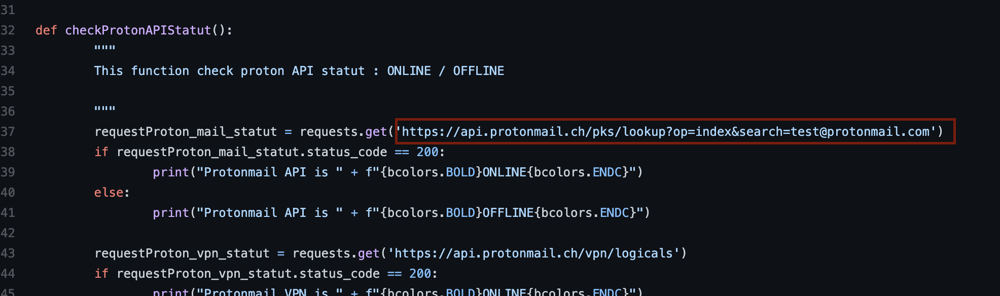
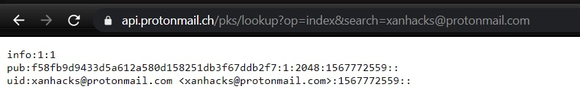

#Hero CTF
## ProtonDate

Category | Points 
--- | --- 
OSINT | 40 

- Google `retrieve creation timestamp protonmail`
- Now we find opensource code https://github.com/pixelbubble/ProtOSINT/blob/main/protosint.py
- Notice interesting request

- Replace test with `xanxacks`
- You need to follow the link under VPN, otherwise it will not work 
- Go to the link, we see this

- We see the timestamp 
- On the site http://timestamp.fr/ translates the label to the date and we get the flag

### Flag=Hero{2019-06-09}