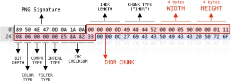
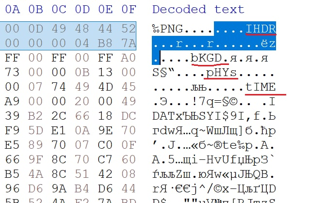

#Hero CTF
## Shake PNG

Category | Points 
--- | --- 
Steganography | 30 

- Open the picture in a hex editor
- Remembering the PNG structure

- We are looking for IHDR and IEND in the search, we understand that they are in the middle 

- Move the chunk from IHDR to the beginning, and the chunk from IEND to the end, a picture with a flag opens

### Flag=HERO{SH4K3_UR_PNG}